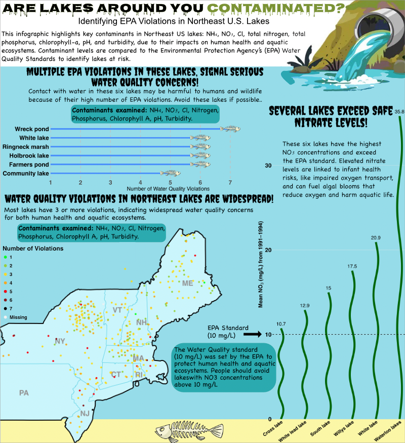

## IV. Write your blog post

### Share your data design process in a short, 1-2 page (\~500-1,000 words) science communication blog post-style write up. Your blog post should be structured as follows:

**1. Open with an engaging introduction, which states any necesssary background, your motivation, question(s), data / data source(s), and goal(s) of your visualization. Storytelling helps to engage your reader**

Do you know whether lakes near you are contaminated? Probably not. To better inform the public about the potential contaminants they may be exposed to, I created an infographic showing which lakes in the Northeast have high levels of contamination. My infographic will answer the following questions: Which lakes in the Northeast United States have a mean nitrate (NO₃) concentration exceeding the EPA water quality standard of 10 mg/L? Which lakes have the greatest number of contaminants exceeding EPA Water Quality Standards? Where are the lakes with contaminant concentrations above EPA Water Quality Standards located? I will be answering these questions using lake water chemistry data from the USEPA EMAP Surface Waters Lake Database. The goal of my infographic is to better inform the public about the exposure risk of each lake around them. This information is hard for the average person to access and understand. I aim to better inform the public about environmental hazards around them, so they can live happy and healthier lives.

2.  **Embed / render your final infographic following your introduction. If you are embedding a png file, ensure that it’s centered and an apppropriate size. The same applies if you are rendering your infographic from code, though you should additionally ensure that:**

-   **just the output renders and not the code (e.g. using code chunk options eval: true & echo: false)**
-   **warnings and messages are suppressed, as necessary (e.g. using code chunk options warning: false & message: false); other intermediate products should not be rendered**

```{r}
#| echo: false
#| warning: false
#| message: false
#| fig-align: center
#| out-width: "80%"


```

3.  **The body of your blog post should address your approach and decisions for the ten design elements listed in the final project description (though you are welcome and encouraged to comment on any others that are not explicitly listed). You may choose to render and refer to individual / component data visualizations throughout the body of your blog post, as necessary or appropriate – if you do so, be sure to suppress code from printing.**

For this infographic I decided to experiment with bar graphs. We learned how to do a lollipop graph in class, but I decided I wanted to try and add a picture at the end of it using `geom_image()` instead of just a dot. I added a fish skeleton to this to add character to the plot and make it more fun. I also wanted to use this picture to show that it is negatively effecting wildlife. Furthermore, I ended up making a second bar graph, so to avoid redundancy I wanted to make it unique. To make the graphic more unique, I placed the lake names on the x-axis and designed the bars to be wavy and green to imitate seaweed. Because the bar graph is visually busy, I added numbers at the top of each wavy bar to make the values easier to read.

In this infographic text (e.g. titles, captions, annotations, axis labels, axis text) were key. I had limited room, but I still had to be able to efficiently communicate what each of my plots is showing and explain what the results mean. To do this I bolded all of my plot titles and axis titles. Due to my light blue background, I also had to color them black for more visibility. My Map plot and lollipop graph were also given subtitles that were not bolded to differentiate them from the main title. I added subtitles to show which contaminates each plot was examining. On my seaweed bar graph I had to tilt the lake names on the x axis because it was too skinny to have all the names be displayed horizontal. In my map text was an important factor in its readability. I wasn't able to add the whole state name due to the lack of space in the smaller states like Rhode Island. So, I had to just add the abbreviation of each state and bold them. I also had to adjust the location of each abbreviation to ensure it wasn't hidden under data points. I also added the font creep to each of my plot titles to make them seem more dangerous and scary.

An important part of this infographic was being able to make sure each plot was able to be smoothly integrated into it. To do this the `theme()` function came in handy. With it I was able to remove plot backgrounds on all of my plots. By doing this I was able to seamlessly add them onto the infographic. I was also able to utilize it to adjust and my font sizes to make them more prominent. To reduce noise in my graphs I was also able to remove the minor grid marks on my plots. The smaller amount of grid marks makes my plots more clean.

Colors are a critical part of every type of visualization. When designing my map I had to make sure to choose a color scale that made sense and was clearly visible. I used a light blue color for the state polygons to match the blue theme of the infographic without taking away from plot. I decided to make the wavy bar graph green to imitate sea weed. The sand at the bottom of the infographic is not only for show it also separates the x axis of the sea weed plot from the y axis.

The topography of my infographic is executed in a way where it looks like a lake. In addition to my lake theme plots, I added a sewage pipe at the top left corner of the infographic to make it look like this is a polluted lake. In addition, I made that background of the infographic light blue to match the color coming out of the pipe. I also added a dead fish at the bottom of the lake to show the polluted water is killing wildlife.

The general design and hierarchy is just like a lake. You start at the top where the title is, similar to the surface of the water. You then end at the bottom of the infographic, where the lake bottom is. The dead fish bar plot is put towards the top because that's where fish like to swim in the water column. The map is in the middle because it needs more space. At the bottom is the sea weed map because seaweed grows at the bottom in the sand.

To contextualize my data I had to find the mean concentration of each contaminant over the years since each lake had more than one observation. I then got the EPA Water Quality Standard for each contaminate to see if each contaminate was at an acceptable concentration. I also added a geom to each lake, so I can plot them on a map. All of these steps allowed me to do all of my analysis.

To center my primary message about lakes being contaminated. I made sure to first show just how much some lakes contaminate concentration are over the EPA Water Quality Standards. My sea weed plot shows that Waterloo lakes is over 3x the EPA Water Quality Standard for NO3. I then showed how many EPA Water Quality Standards each lake violated to show that this isn't just a problem in NO3. I lastly displayed locations of lakes with EPA Water Quality Standard violations to really put things into perspective for people. Viewers can see where they live on the map and see just how many contaminated lakes are around them.

I make sure that this infographic's colors are accessible and makes sense. Even if they have trouble seeing the two bar graphs I displayed the total value above each bar to make it easier. I made sure to choose a light colored map, so the dots stand out more. I also colored the outine of the map's polygon dark black, so its easy to see. This also helps the map contrast against the light blue background.

DEI plays a very big role in this visualization. Unfortunately, people in areas of low income and high concentrations of minority groups are more likely to experience environmental injustices. These injustices effect factors in their lives like air quality, temperature, and water quality. This info graphic can be used as a guide for people to ensure the lakes they choose to go to are safe because the likelihood of a contaminated lake being in a low income neighborhood are high.


4.  **Include the all code used to generate your final data viz products in a single foldable code chunk (see code chunk option, code-fold: true), at the end of your blog post. Be sure to include some written text beforehand that lets your readers know that they can explore the full code by expanding the chunk. Here, your code should:**

-   **print, but not execute (i.e. use code chunk options eval: false & echo: true)**
-   **be appropriately styled (e.g. following tidyverse style guide) and annotated**

The folded code chunk below shows all the code used to produce all 3 visualizations used in this infographic.

```{r}
#| code-fold: true
#| eval: false
#| echo: true

# Load in libraries
library(here)
library(tidyverse)
library(ggplot2)
library(ggimage)
library(sf)
library(tmap)
library(tigris)
library(dplyr)
library(stringr)

# Read in Data
lake_data <- read_csv(here("posts/2026-03-19-lake_infographic/data/EPA_EMAP_CHEM.csv"))

# Find the mean NH4, NO3, NTL, PTL, CHLA, CL, PHEQ, TURB value for each lake
grouped_2 <- lake_data |>
  group_by(LAKENAME) |>
  summarize(
    mean_NH4  = mean(NH4,  na.rm = TRUE),
    mean_NO3  = mean(NO3,  na.rm = TRUE),
    mean_NTL  = mean(NTL,  na.rm = TRUE),
    mean_PTL  = mean(PTL,  na.rm = TRUE),
    mean_CHLA = mean(CHLA, na.rm = TRUE),
    mean_CL   = mean(CL,   na.rm = TRUE),
    mean_PHEQ = mean(PHEQ, na.rm = TRUE),
    mean_TURB = mean(TURB, na.rm = TRUE),
    LAT_DD = mean(LAT_DD, na.rm = TRUE),
    LON_DD = mean(LON_DD, na.rm = TRUE)
  )

# Convert units to match EPA WQS

# NH4: microequivalentsPerLiter to mg/L
grouped_2$mean_NH4 <- grouped_2$mean_NH4 * 0.01804
# NO3: microequivalentsPerLiter to mg/L
grouped_2$mean_NO3 <- grouped_2$mean_NO3 * 0.062
# NTL: microgramsPerLiter to mg/L
grouped_2$mean_NTL <- grouped_2$mean_NTL / 1000
# PTL: microgramsPerLiter to mg/L
grouped_2$mean_PTL <- grouped_2$mean_PTL / 1000
# CL: microequivalentsPerLiter to mg/L
grouped_2$mean_CL <- grouped_2$mean_CL * 0.03545


# Add EPA WQS threshold columns
grouped_2$wqs_NH4   <- 0.1      # mg/L
grouped_2$wqs_NO3   <- 10       # mg/L
grouped_2$wqs_NTL   <- 1        # mg/L
grouped_2$wqs_PTL   <- 0.10     # mg/L
grouped_2$wqs_CHLA  <- 5        # μg/L 
grouped_2$wqs_CL    <- 230      # mg/L
grouped_2$wqs_PHEQ  <- 7.0      # pH 
grouped_2$wqs_TURB  <- 5        # NTU

# Count violations for each lake
grouped_2$violations <- 
  (grouped_2$mean_NH4 >= grouped_2$wqs_NH4) +
  (grouped_2$mean_NO3 >= grouped_2$wqs_NO3) +
  (grouped_2$mean_NTL >= grouped_2$wqs_NTL) +
  (grouped_2$mean_PTL >= grouped_2$wqs_PTL) +
  (grouped_2$mean_CHLA >= grouped_2$wqs_CHLA) +
  (grouped_2$mean_CL >= grouped_2$wqs_CL) +
  ((grouped_2$mean_PHEQ < 6.5) | (grouped_2$mean_PHEQ > 8.5)) +
  (grouped_2$mean_TURB >= grouped_2$wqs_TURB)

# NH4: microequivalentsPerLiter to mg/L
grouped_2$mean_NH4 <- grouped_2$mean_NH4 * 0.01804

# Find the mean NO3 value for each lake
grouped <- lake_data |>
  group_by(LAKENAME) |>
  summarize(mean_NO3 = mean(NO3))

# Convert units to mg/L
grouped$mean_NO3 <- grouped$mean_NO3 * 0.062

# Find mean NO3 value for each lake
grouped <- lake_data |>
  group_by(LAKENAME) |>
  summarize(mean_NO3 = mean(NO3, na.rm = TRUE)) |>
  mutate(
    mean_NO3 = mean_NO3 * 0.062,
    LAKENAME = str_to_sentence(LAKENAME)
  ) |>
  arrange(desc(mean_NO3)) |>
  slice_head(n = 6)

# Make lake order numeric for wave plotting
grouped$LAKENAME <- factor(grouped$LAKENAME, levels = rev(grouped$LAKENAME))
grouped$x <- as.numeric(grouped$LAKENAME)

# Make bars wavy
wave_data <- grouped |>
  rowwise() |>
  do({
    y_vals <- seq(0, .$mean_NO3, length.out = 200)
    data.frame(
      LAKENAME = .$LAKENAME,
      y = y_vals,
      x = .$x + 0.1 * sin(seq(0, 5*pi, length.out = 200))
    )
  })

# Plot
NO3 <- ggplot(grouped, aes(x = x, y = mean_NO3)) +
  geom_path(
    data = wave_data,
    aes(x = x, y = y, group = LAKENAME),
    color = "darkgreen",
    linewidth = 5
  ) +

  # value labels
  geom_text(
    aes(label = signif(mean_NO3,3)),
    vjust = -.8,
    size = 9
  ) +

  # EPA WQS line
  geom_hline(
    yintercept = 10,
    linetype = "dashed",
    linewidth = 1
  ) +

  scale_x_continuous(
    breaks = grouped$x,
    labels = grouped$LAKENAME
  ) +
  scale_y_continuous(expand = expansion(mult = c(0, 0.02))) +

  labs(
    x = "Lakes",
    y = expression(bold("Mean " * NO[3] * " (mg/L) from 1991–1994)"))
    #title = "Lakes with Mean NO3 Concentrations Exceeding EPA Water Quality Standards"
  ) +
  
  theme_minimal() +
  
  theme(
    axis.title.y = element_text(size = 28, face = "bold"),
    axis.title.x = element_blank(),
    axis.text.y = element_text(size = 30, face = "bold", color = "black"),
    axis.text.x = element_text(size = 24, face = "bold", color = "black", angle = 37, hjust = 1),
    
    panel.grid.major.x = element_blank(),   # remove x axis gridlines
    panel.grid.minor.x = element_blank(),
      panel.grid.minor.y = element_blank(),

    text = element_text(size = 18),
    #axis.title = element_text(size = 16),
    plot.title = element_text(size = 22, face = "bold"),
    legend.text = element_text(size = 14),
    legend.title = element_text(size = 16),
    plot.background = element_rect(fill = "transparent", color = NA),
    panel.background = element_rect(fill = "transparent", color = NA)
  )

  # Save the plot
# ggsave(
#   plot = NO3,
#   filename = "NO3_bar.png",
#   width = 11,
#   height = 24.3,
#   units = "in",
#   dpi = 300,
#   bg = "transparent"
# )

# View the plot
NO3

# Read dead fish image
skull_url <- here::here("images/skelleton.png")

EPA_line <- grouped_2 |>
  arrange(desc(violations)) |>
  slice_head(n = 6) |>
  mutate(
    LAKENAME = str_to_sentence(gsub("\\s*\\(largest\\)", "", LAKENAME, ignore.case = TRUE)),
    skull_img = skull_url
  ) |>
  ggplot(aes(x = reorder(LAKENAME, violations),
             y = violations)) +
  geom_linerange(aes(ymin = 1, ymax = violations),
                 color = "dodgerblue",
                 linewidth = 2) +
  geom_image(aes(image = skull_img), size = 0.4) +
  #geom_text(aes(label = violations, hjust = -4.5), size = 5.5) +
  labs(
    x = "Lakes",
    y = "Number of Water Quality Violations") +
    #title = "Lakes with Most EPA Water Quality Standards (WQS) Violations",
    #subtitle = "Contaminants examined: NH4, NO3, Cl, Total Nitrogen, Total Phosphorus, Chlorophyll A, pH, Turbidity") +
  coord_flip() +
scale_y_continuous(
  limits = c(1, max(grouped_2$violations, na.rm = TRUE)),
  breaks = 1:7,
  expand = expansion(mult = c(0, .31))
) +
  theme_minimal() +
  theme(
    axis.title.y = element_blank(),
    axis.text.y = element_text(size = 18, face = "bold", color = "black"),
    axis.text.x = element_text(size = 18, face = "bold"),
    panel.grid.major.y = element_blank(),
    panel.grid.minor.y = element_blank(),
    panel.grid.major.x = element_line(
      color = "gray76",
      linetype = "dashed",
      linewidth = .9),    
    panel.grid.minor.x = element_blank(),
    text = element_text(size = 18),
    axis.title = element_text(size = 16),
    plot.title = element_text(size = 22, face = "bold"),
    plot.subtitle = element_text(size = 13),
    plot.caption = element_text(size = 9),
    plot.background  = element_rect(fill = NA, color = NA),
    panel.background = element_rect(fill = NA, color = NA)
  )

  # Save the plot
# ggsave(
#   plot = EPA_line,
#   filename = "EPA_line.png",
#   width = 12,
#   height = 3,
#   units = "in",
#   dpi = 300,
#   bg = "transparent"
# )

# View plot
EPA_line

# Gather aberviations
states_ne <- c("ME","NH","VT","MA","RI","CT","NY","NJ","PA")

states_sf <- states(year = 2023) |>
  filter(STUSPS %in% states_ne) |>
  st_as_sf()


# Add manual offsets for each state abbreviation
states_sf <- states_sf %>%
  mutate(
    x_offset = case_when(
      STUSPS == "ME" ~ 0.9,
      STUSPS == "NH" ~ 0.5,
      STUSPS == "VT" ~ 0,
      STUSPS == "MA" ~ 0,
      STUSPS == "RI" ~ 0.1,
      STUSPS == "CT" ~ 0,
      STUSPS == "NY" ~ -0.5,
      STUSPS == "NJ" ~ 0.4,
      STUSPS == "PA" ~ 0,
      TRUE ~ 0
    ),
    y_offset = case_when(
      STUSPS == "ME" ~ 0.0,
      STUSPS == "NH" ~ 0.0,
      STUSPS == "VT" ~ 0.3,
      STUSPS == "MA" ~ 0.2,
      STUSPS == "RI" ~ -0.1,
      STUSPS == "CT" ~ -0.0,
      STUSPS == "NY" ~ 0,
      STUSPS == "NJ" ~ -0.3,
      STUSPS == "PA" ~ -0.2,
      TRUE ~ 0
    )
  )

# Convert grouped_2 to spatial object
grouped_2_sf <- st_as_sf(grouped_2, 
                         coords = c("LON_DD", "LAT_DD"), 
                         crs = 4326)

# Rename violations column and make it an integer
grouped_2_sf <- grouped_2_sf %>%
  rename(`Number of Violations` = violations) %>%
  mutate(`Number of Violations` = factor(`Number of Violations`))

ne_outline <- states_sf |>
  st_union() |>
  st_as_sf()

NE_map <- tm_shape(states_sf) +
  tm_polygons(col = "#C7F5FC", border.col = "#41CBE2", lwd = 4) +

  tm_shape(ne_outline) +
  tm_borders(col = "black", lwd = 10) +   # Make outer regional outline bold black

  tm_shape(states_sf) +
  tm_text(
    "STUSPS",
    size = 5,
    col = "#919191",
    fontface = "bold",
    xmod = "x_offset",
    ymod = "y_offset"
  ) +

  tm_shape(grouped_2_sf) +
  tm_dots(
    col = "Number of Violations",
    size = 1.3,
    palette = c("green", "yellowgreen", "gold", "orange", "red", "firebrick4", "black")
  ) +

  tm_layout(
    frame = FALSE,
    legend.show = FALSE,
    bg.color = "transparent"
  ) 

# tmap_save(
#   tm = NE_map,
#   filename = "NE_map.png",
#   width = 30,   
#   height = 30,
#   units = "in",
#   dpi = 300,     # resolution
#   bg = "transparent" # Take away background
# )

# Show map
NE_map
```


