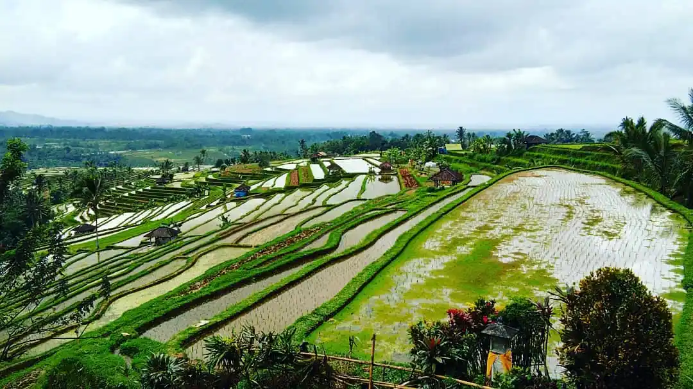

## [Repository Link](https://github.com/austinmartinez12/eds241-final-project)



## Introduction

Imagine you are a farmer in rural Indonesia. The rains fail this year. Your harvest is poor. Money is tight, and tensions rise in your community. Now imagine your district has a large irrigation system fed by a dam. Does that change things? Does having a reliable water supply during a bad rain year keep your community calmer?

That is the question at the heart of this blog post. We are walking you through a replication of a study by Gatti, Baylis, and Crost (2021), published in the *American Journal of Agricultural Economics*. The paper asks "when rainfall is low and crops fail, does irrigation infrastructure reduce conflict?"

This is an important question because climate change is expected to bring more frequent droughts and rainfall shocks, especially in tropical agricultural countries. If irrigation can buffer communities against those shocks, that has big implications for where governments should invest.

In this post we describe the data used in the study, walk you through the statistical models the authors used to estimate the treatment effect, explain what the results mean, and reflect on the strengths and limitations of the approach.

## Overview

This study examines patterns in irrigation and conflict across districts in Indonesia. There is a well established link in the literature between rainfall shocks, agricultural income, and civil conflict (e.g., Miguel, Satyanath & Sergenti, 2004; Miguel & Satyanath, 2011; Klomp & Bulte, 2013; Fetzer, 2014a, b; Hsiang and Burke, 2014; Maystadt and Ecker, 2014; Wischnath and Buhaug, 2014; Burke, Hsiang and Miguel, 2015; Axbard, 2016). The authors of this paper sought to investigate the mechanisms that underlie this relationship. Given agriculture's crucial role in economic development, and irrigation's crucial role in sustaining agricultural productivity, Gatti et al. test whether agricultural production is part of the causal link between rainfall and conflict, and whether this link can be mitigated by irrigation infrastructure. Indonesia was chosen as the study area because of its long history of civil conflict and the importance of agriculture to household income. There are many observed and unobserved differences across Indonesia's provinces and districts that have the potential to confound the relationship between irrigation and conflict.

A primary concern is that irrigation facilities may be built predominantly in districts with lower conflict potential, perhaps because they are more economically developed or ethnically homogeneous, which would make irrigation appear protective even in the absence of any true causal effect. Another concern is that irrigation could affect conflict indirectly by shaping property rights over agricultural land, where those rights help maintain social stability during periods of economic stress. Given the need to account for stable, time-invariant district characteristics that may simultaneously influence both irrigation investment and conflict levels, fixed Effects was a natural choice for a statistical method.

By absorbing all time-invariant unobservables at the district level (terrain and geography, ethnic and religious composition, historical patterns of land ownership, proximity to urban centers, baseline infrastructure quality), along with province-specific time trends and year fixed effects, the fixed effects approach allows the analysis to focus on within-district variation over time. Instrumental variables are also employed to address the concern that current irrigation capacity may itself be endogenous to conflict or rainfall. Specifically, the authors instrument current irrigation capacity with baseline irrigation capacity measured in 1997, the year before the observation period begins. Because pre-period irrigation cannot have been built in response to post 1997 conflict outcomes, this instrument strengthens the causal interpretation of the results.

## Data Description

The dataset used in this study covers 201 Indonesian districts observed annually from 1998 to 2014. Each row in the data represents one district in one year, giving a total of 3,417 district-year observations. Two major urban areas, Jakarta and Yogyakarta, were removed from the analysis because their economies are dominated by manufacturing and services rather than agriculture. Since the whole argument of the paper is about how irrigation protects agricultural income from rainfall shocks, keeping cities where almost nobody farms would distort the results.

### Load necessary libraries

```{r}
# Load in libraries
suppressMessages({
  library(haven)
  library(tidyverse)
  library(kableExtra)
  library(fixest)
  library(modelsummary)
})
```

### Read in the dataset

```{r}
# Gathering data from .dta file
#raw_data <- read_dta("data/AJAE MS#19355-Data and Codes-Gatti/data.dta")

# Create CSV from dta file
# write.csv(raw_data, "data/irrigation_data.csv", row.names = FALSE)

# Read in data
irrigation <- read_csv(here::here("posts/2026-03-20-conflict/data/irrigation_data.csv"))
```

### Measuring conflict

The study counts the total number of conflict incidents per district per year. This data comes from the Indonesian National Violence Monitoring System, which tracks conflict events reported in provincial newspapers across the country. In later sections, the authors also break this down into six subtypes, including resource disputes, popular justice, ethnic conflicts, and separatist movements. The key split the authors care about is between economically motivated conflicts and political or identity based ones.

### Rainfall as the treatment variable

The main explanatory variable is growing season rainfall, measured as a z-score within each district. A z-score simply tells you how different a given year's rainfall was from that district's own long run average. A z-score of -1 means rainfall was one standard deviation below average; a z-score of +1 means it was one standard deviation above average. This is important because it measures relative dryness or wetness within a district, not whether one district is generally wetter than another. That way, the comparison is always a given district against its own history, not against a neighboring district with a completely different climate.

The main variable of interest is not rainfall alone, but the interaction between rainfall and baseline irrigation capacity, which is fixed at 1997 levels. This interaction tells us whether the effect of a drought on conflict is different in districts with more irrigation versus less. If irrigation is protective, we expect to see: low rainfall raises conflict in poorly irrigated districts, but that increase is smaller in well irrigated ones.

### Controls and fixed effects

The models include growing season temperature and its interaction with irrigation, since heat also affects crop yields. Beyond that, the models use district fixed effects (to remove stable differences between districts), year fixed effects (to remove nationwide trends in any given year), and province specific time trends (to allow for the fact that some provinces were already trending toward more or less conflict over time for reasons unrelated to weather). These controls together ensure that the rainfall conflict relationship is estimated from within district, year to year changes, not from differences between districts that might reflect other things entirely.

### Estimating the effect of rainfall and irrigation on conflict

The four models in the next code chunk replicate Table 3 from the paper, which is the core OLS result. Each model regresses a binary conflict indicator on growing-season rainfall and its interaction with irrigation, controlling for year fixed effects and province-specific linear time trends.

The key coefficient of interest is the interaction between growing-season rainfall and irrigation capacity `z_rain_ground_dams_ha`. If irrigation buffers the negative income shock from poor rainfall, we expect this interaction to be positive: in high-irrigation districts, a rainfall shock should translate less strongly into conflict. The direct effect of rainfall (`z_rgrowing_season_cm`) captures the baseline relationship in districts without irrigation.

The four columns vary the specification in ways that test robustness. The baseline model (1) includes province-specific trends; model (2) tightens this by adding district-specific trends, which is a more demanding test since it absorbs any district-level time trend that might confound the result. Model (3) swaps baseline irrigation for current-year irrigation, which raises endogeneity concerns we will address in the IV section. Model (4) replaces rainfall with IHS-transformed rice production directly, which tests whether the mechanism runs through agricultural output as the theory predicts, if production mediates the rainfall–conflict link, a negative coefficient here would be consistent with that story.

## Replication of Table 3: The Effect of Growing-Season Rainfall and Irrigation Capacity on Conflict

```{r}

# Run a fixed effects OLS for `m3_c1` with province-specific linear trends.
m3_c1 <- feols(
  conflict ~ z_rgrowing_season_cm + z_rain_ground_dams_ha +
             z_tgrowing_season + z_temp_ground_dams_ha +
             factor(year) + year:factor(prov) | district_code,
  data    = irrigation,
  cluster = ~district_code
)

# Run a fixed effects OLS for `m3_c2` with district-specific linear trends.
m3_c2 <- feols(
  conflict ~ z_rgrowing_season_cm + z_rain_ground_dams_ha +
             z_tgrowing_season + z_temp_ground_dams_ha +
             factor(year) + year:factor(district_code) | district_code,
  data    = irrigation,
  cluster = ~district_code
)

# Run a fixed effects OLS for `m3_c3` to calculate rice production on conflict
m3_c3 <- feols(
  conflict ~ z_rgrowing_season_cm + z_rain_irrigation_cont +
             z_tgrowing_season + z_temp_irrigation_cont +
             factor(year) + year:factor(prov) | district_code,
  data    = irrigation,
  cluster = ~district_code
)

# Run a fixed effects OLS for `m3_c4` OLS using current-year irrigation
m3_c4 <- feols(
  conflict ~ ihs_total_prod +
             factor(year) + year:factor(prov) | district_code,
  data    = irrigation,
  cluster = ~district_code
)

# Count number of districts in `irrigation` data frame
n_districts <- n_distinct(irrigation$district_code)

# Make a data frame to assign the number of districts to each OLS.
number_of_districts <- data.frame(
  term       = "Number of Districts",
  `(1) OLS`  = as.character(n_districts),
  `(2) OLS`  = as.character(n_districts),
  `(3) OLS`  = as.character(n_districts),
  `(4) OLS`  = as.character(n_districts),
  check.names = FALSE
)

# Create a summary table to display results side by side for all 4 conflict models
modelsummary(
  list(
        "1) Baseline OLS" = m3_c1,
        "2) District Level Trends" = m3_c2,
        "3) Current Irrigation" = m3_c3,
        "4) Rice Production" = m3_c4
  ),
    coef_map = c(
    "ihs_total_prod"          = "ihs(rice production)",
    "z_rgrowing_season_cm"    = "GS Rainfall",
    "z_rain_ground_dams_ha"   = "GS Rainfall × Baseline Irrigation Capacity",
    "z_rain_irrigation_cont"  = "GS Rainfall × Current Irrigation Capacity"
  ),
  gof_map = list(
    list(raw = "nobs",      clean = "Observations", fmt = 0),
    list(raw = "r2.within", clean = "R-squared",    fmt = 3)
  ),
  add_rows = number_of_districts,
  stars    = c("*" = 0.1, "**" = 0.05, "***" = 0.01),
  fmt      = "%.3f",
  output   = "gt"
) %>%
  gt::tab_header(
    title = gt::md("**Table 3: Effect of Growing-Season Rainfall and Irrigation on Conflict**")
  ) %>%
  gt::tab_spanner(
    label   = gt::md("*Number of conflict incidents*"),
    columns = 2:5
  ) %>%
  gt::tab_style(
    style     = gt::cell_text(style = "italic"),
    locations = gt::cells_body(columns = 1, rows = c(1, 3, 5, 7))
  ) %>%
  gt::tab_options(
    table.width                       = gt::pct(100),
    data_row.padding                  = gt::px(2),
    table.font.size                   = gt::px(13),
    table.border.top.style            = "hidden",
    table.border.bottom.style         = "hidden",
    heading.border.bottom.style       = "hidden",
    column_labels.border.top.width    = gt::px(2),
    column_labels.border.bottom.width = gt::px(1),
    table_body.border.bottom.width    = gt::px(2),
    table_body.hlines.width           = gt::px(0)
  )
```

## Reading the Results from Table 3

As we interpret these models, here is what we are looking for: if irrigation is protective, the coefficient on the interaction between rainfall and irrigation should be positive. A positive number here means that when rainfall is low, districts with more irrigation see a smaller increase in conflict compared to districts with less irrigation.

**Baseline model with province trends:** Our first model estimates whether growing-season rainfall affects conflict, and whether irrigation changes that relationship, after controlling for temperature, district fixed effects, year fixed effects, and province-specific time trends. The `| district_code` in the code absorbs all stable differences between districts. The `factor(year)` term controls for events that hit all districts in the same year (like a national election or a nationwide economic downturn). The `year:factor(prov)` term allows each province to follow its own trend over time, which accounts for the fact that some provinces were already becoming more or less conflict-prone for reasons unrelated to weather.

You may notice that the coefficient on GS Rainfall alone is not statistically significant in this column. This is expected and is actually consistent with the paper's argument. The rainfall coefficient here only captures the effect of rainfall in a district with average irrigation levels. The paper's main claim is not that rainfall affects conflict uniformly across all districts; it is that the effect of rainfall on conflict depends on how much irrigation a district has. That means the key number to look at is the interaction term: GS Rainfall x Baseline Irrigation. A positive, significant coefficient there means that more irrigation reduces the conflict impact of a drought, which is exactly what Table 3 shows.

**District-level trends:** The second model applies stricter version of the same model, giving each individual district its own time trend rather than one shared across a province. This is a more demanding test. If irrigation remains significant even after absorbing district-specific trends, that is stronger evidence the finding is not driven by some districts simply trending toward less conflict over time for other reasons.

**Robustness check with current irrigation:** The third model swaps out the 1997 baseline irrigation for current-year irrigation as a robustness check. If the pattern holds with both measures of irrigation, that gives us more confidence the result is not an artifact of the way irrigation is measured.

**Validating the causal chain through rice production:** The final model replaces rainfall entirely with a measure of rice production. The goal here is to trace the mechanism. If irrigation is reducing conflict by protecting agricultural income, then lower rice production should predict more conflict. This model asks whether the rainfall-to-conflict pathway runs through the agricultural channel, as the authors argue.

The causal argument across all four models rests on the combination of district fixed effects and the use of 1997 baseline irrigation (rather than current irrigation levels) as the measure of irrigation capacity. Because the 1997 baseline predates the study period, it cannot have been built in response to post-1998 conflict. This removes the concern that districts built more irrigation because they were becoming more peaceful, which would make irrigation look protective for the wrong reason.

For these estimates to reflect a true causal effect, three conditions need to hold. Rainfall must be outside human control (it is), irrigation placement must not be driven by unobserved factors that also affect how conflict responds to drought (partially addressed through the baseline measure and robustness checks), and there must be no time-varying factors inside each district that respond to rainfall shocks and also drive conflict through a channel other than agriculture (the hardest condition to fully verify).

**Reading the output:** Nothing stands out as a clear violation of our assumptions. The irrigation interaction is significant in the agricultural direction, the rainfall-only coefficient is insignificant in the expected way (it reflects the effect at mean irrigation, not the marginal effect of interest), and the results hold across different model specifications. The pattern is consistent with the paper's argument.

## Replication of Table 8: Impact of Growing-Season Rainfall on Conflict in Rural versus Urban Areas

Table 3 tells us that districts with more irrigation see less conflict during droughts. But how do we know that this is actually about farming, and not just about some other feature of well-irrigated districts? One powerful way to check is to ask: does the effect show up only in places where agriculture matters?

This next step splits the 201 districts into two groups based on per capita agricultural area planted to the three major staple crops: rice, corn, and cassava. The median value of `agric_per_capita` in the data is used as the cutoff: districts at or above the median are called agricultural districts, and those below the median are called non-agricultural districts. The paper uses per capita planted area rather than income because it is a more direct measure of how much a district depends on farming as a land use, and it is not affected by price fluctuations that could conflate agricultural dependence with wealth. The median was chosen as the dividing line rather than some arbitrary threshold because it splits the sample cleanly in half, giving a balanced comparison without assumptions about what counts as "enough" agriculture. The idea is simple: if irrigation is reducing conflict by protecting farm income, the effect should show up strongly in agricultural districts and should be weak or absent in non-agricultural ones. If irrigation reduced conflict in both types of districts equally, that would suggest the effect is not really about agriculture at all, but about something else that comes with irrigation, like economic development or better infrastructure.

```{r}
# Compute the sample median `agric_per_capita`
med_agric <- median(irrigation$agric_per_capita, na.rm = TRUE)

# Create subsamples: `agric_data` for samples above median and `non_agric_data` for data under median
agric_data     <- irrigation %>% filter(agric_per_capita >= med_agric)
non_agric_data <- irrigation %>% filter(agric_per_capita <  med_agric)


#Run a fixed effects OLS for `m8_c1` and `m8_c2` to calculate the rainfall effect without irrigation interaction on agric_data and non_agric_data. 
m8_c1 <- feols(
  conflict ~ z_rgrowing_season_cm + z_tgrowing_season +
             factor(year) + year:factor(prov) | district_code,
  data = agric_data, cluster = ~district_code
)

m8_c2 <- feols(
  conflict ~ z_rgrowing_season_cm + z_tgrowing_season +
             factor(year) + year:factor(prov) | district_code,
  data = non_agric_data, cluster = ~district_code
)

#Run a fixed effects OLS for `m8_c3` and `m8_c4` to calculate the rainfall effect with irrigation interaction on agric_data and non_agric_data. 
m8_c3 <- feols(
  conflict ~ z_rgrowing_season_cm + z_rain_ground_dams_ha +
             z_tgrowing_season + z_temp_ground_dams_ha +
             factor(year) + year:factor(prov) | district_code,
  data = agric_data, cluster = ~district_code
)

m8_c4 <- feols(
  conflict ~ z_rgrowing_season_cm + z_rain_ground_dams_ha +
             z_tgrowing_season + z_temp_ground_dams_ha +
             factor(year) + year:factor(prov) | district_code,
  data = non_agric_data, cluster = ~district_code
)

# Counts the amount of districts in `agric_data` and `non_agric_data`
n_districts_agric     <- n_distinct(agric_data$district_code)
n_districts_non_agric <- n_distinct(non_agric_data$district_code)

# Make a data frame to assign the number of districts to each OLS.
number_of_districts2 <- data.frame(
  term = "Number of Districts",
  `(1) Agricultural, No Int.`     = as.character(n_districts_agric),
  `(2) Non-Agricultural, No Int.` = as.character(n_districts_non_agric),
  `(3) Agricultural, With Int.`   = as.character(n_districts_agric),
  `(4) Non-Agricultural, With Int.` = as.character(n_districts_non_agric),
  check.names = FALSE
)


# Create a summary table to display results side by side for agricultural and non-agricultural districts
modelsummary(
  list(
    "(1) Agricultural, No Int."       = m8_c1,
    "(2) Non-Agricultural, No Int."   = m8_c2,
    "(3) Agricultural, With Int."     = m8_c3,
    "(4) Non-Agricultural, With Int." = m8_c4
  ),

  coef_map = c(
    "z_rgrowing_season_cm"  = "GS Rainfall",
    "z_rain_ground_dams_ha" = "GS Rainfall × Irrigation capacity"
  ),
  gof_map = list(
    list(raw = "nobs",      clean = "Observations", fmt = 0),
    list(raw = "r2.within", clean = "R-squared",    fmt = 3)
  ),
  add_rows = number_of_districts2,
  stars    = c("*" = 0.1, "**" = 0.05, "***" = 0.01),
  fmt      = function(x) formatC(x, digits = 3, format = "g"),
  output   = "gt"
) %>%
  gt::tab_header(
    title = gt::md("**Table 8. Impact of Growing-Season Rainfall on Conflict in Rural versus Urban Areas**")
  ) %>%
  gt::tab_spanner(
    label   = gt::md("*Number of conflict incidents*"),
    columns = 2:5
  ) %>%
  gt::tab_style(
    style     = gt::cell_text(style = "italic"),
    locations = gt::cells_body(columns = 1, rows = c(1, 3))
  ) %>%
  gt::tab_options(
    table.width                       = gt::pct(100),
    data_row.padding                  = gt::px(2),
    table.font.size                   = gt::px(13),
    table.border.top.style            = "hidden",
    table.border.bottom.style         = "hidden",
    heading.border.bottom.style       = "hidden",
    column_labels.border.top.width    = gt::px(2),
    column_labels.border.bottom.width = gt::px(1),
    table_body.border.bottom.width    = gt::px(2),
    table_body.hlines.width           = gt::px(0)
  )
```

## Reading the Results from Table 8

This code accomplished three main tasks:

-   The first part of the code finds the median `agric_per_capita`. Then this median is used to split the data into 2 sub samples: `agric_data` (Agricultural) and `non_agric_data` (Non-Agricultural). Samples below the median are `non_agric_data` (Non-Agricultural) and samples above or equal to the median are `agric_data` (Agricultural). The median of agricultural income per capita was used as the cutoff because the authors wanted to distinguish districts that are agriculture dependent from those who are less so. Splitting up the districts this way allows them to test whether the effects of rainfall shocks and irrigation on conflict are concentrated in districts with higher agricultural dependence.

-   The second part of the code runs 4 regressions using the same fixed effects OLS. These 4 regressions are used to test if the effect of rainfall shocks on conflict differs depending on the districts agricultural dependence and access to irrigation. The first 2 fixed effects OLSs (`m8_c1` and `m8_c2`) calculate the rainfall effect without irrigation interaction on `agric_data` (Agricultural samples) and `non_agric_data` (Non-Agricultural samples). This allows the author to see the baseline effect of rainfall shocks on conflict and compare this baseline between agricultural and non-agricultural districts. The last 2 fixed effects OLSs (`m8_c3` and `m8_c4`) calculate the rainfall effect with irrigation interaction on `agric_data` (Agricultural samples) and `non_agric_data` (Non-Agricultural samples). These tests allow the author to see if irrigation changes the effect of rainfall shocks on conflict and if this effect differs between agricultural and non-agricultural dependent districts.

-   The last part of the code counts the amount of districts in `non_agric_data` and `agric_data` and makes them into a data frame to add the number of districts into the summary table. It then creates a summary table showing the results side by side to compare coefficients for Agricultural and Non-Agricultural samples.

The causal identification approach was a natural experiment that used rainfall since it has variation from year to year. Since rainfall isn't influenced by people, political, or economic conditions in a district, the effect that rainfall has on conflict is causal not just correlational.

### Key assumptions in this test

The assumptions that must hold for the estimates to be causally valid are:

-   **Rainfall is exogenous**: Rainfall is exogenous because weather patterns are determined by natural processes, meaning it is unlikely to be influenced by human behavior or conflict outcomes. The only concern is that rainfall measurement error is correlated with certain regions. This could cause bias because it would allow for systematic differences in how rainfall measurements are collected.
-   **No time-varying confounders**: This assumption was most likely violated because it is hard to fully account for all time-varying factors, even with fixed effects. For example, changes in economic conditions and government policies could affect conflict and rainfall impacts over time. This could cause bias.
-   **Irrigation placement is exogenous conditional on controls**: This assumption is likely violated because irrigation placement may be endogenous to factors like economic development or government investment priorities. This can create systematic differences, leading to biased estimates.

There are signs in the output that these assumptions are satisfied. In Table 8 you can see that the effect of irrigation only shows up significant in agricultural districts and is insignificant in non-agricultural districts. With this you can clearly see that irrigation is working through agriculture rather than through other unobserved variables. If there were other unobserved variables the effect would show in both types of districts.

## Critical Evaluation

### The causal identification strategy

The identification strategy is credible. Rainfall goes up and down from year to year because of large-scale climate patterns like El Nino, which operate at a global scale and have nothing to do with local political or economic conditions in any Indonesian district. This is what makes rainfall useful as a natural experiment: nobody controls the rain, and a bad rain year in one district is not caused by something that also separately causes more conflict.

For the results to reflect a true cause-and-effect relationship, four conditions would need to be met. First, rainfall shocks must be effectively random with respect to local district conditions. This is reasonable given that El Nino and other major climate patterns are driven by ocean and atmosphere dynamics far beyond any district's influence. Second, districts that had more irrigation in 1997 must not be systematically different from less-irrigated districts in other ways that also affect how they respond to drought. Third, all districts must have been on broadly similar conflict trajectories before the study period began, so that irrigated and non-irrigated districts are genuinely comparable. Fourth, conflict in one district must not simply spill over to a neighboring district when drought strikes, since that kind of displacement would make the buffering effect look smaller than it really is.

### How well do the assumptions hold up

The authors cannot directly test whether irrigated and non-irrigated districts were on parallel conflict trends before 1998, because the conflict data only starts in that year. This is a genuine limitation. What they do instead is show that results barely change when district-specific time trends are added to the model (Column 2 of Table 3), which makes it less likely that the findings are driven by some districts already trending toward less conflict for unrelated reasons.

For the exclusion restriction, which says that 1997 irrigation capacity should only affect post-1998 conflict through its effect on agricultural income and not through any other channel, the authors offer two supporting pieces of evidence. The irrigation buffering effect shows up only for economically motivated conflicts (resource disputes and popular justice) and not for ethnic or separatist conflicts. If irrigation were simply picking up the effect of being a more developed or better-governed district, we would expect it to reduce all conflict types, not just the economic ones. A placebo test in the original paper (not replicated here) also shows that hydropower dam capacity, which has similar geographic placement patterns as irrigation dams but no farming function, does not reduce conflict. This strongly points to agriculture as the channel.

Overall, the evidence is fairly convincing but not airtight. The missing pre-trend test and the possibility that irrigated districts differ from non-irrigated ones in unobservable ways remain as the two main gaps.

### Who is in the sample and where results apply

The sample covers 201 Indonesian districts from 1998 to 2014. These are predominantly rural, rice-growing districts where the government owns and operates most irrigation infrastructure. The findings are most directly applicable to other rural agricultural districts in developing countries that share these features: smallholder farming households, government-managed irrigation systems, and rainfall-sensitive crop production.

The results are less likely to transfer to countries with very different agricultural systems or institutional contexts. For the findings to travel, a country would need similar conditions: farming households that are economically vulnerable to rainfall shocks, and irrigation systems capable of substituting for rainfall during dry years. Countries with rainfed agriculture but no government capacity to build and maintain irrigation would not be expected to show the same effect. Highly commercialized agricultural systems, where farm income is less directly tied to local rainfall, would also likely behave differently.

### How the variables are measured

The rainfall and irrigation variables appear to be measured carefully. Rainfall is drawn from satellite and station data, and irrigation capacity is sourced from the Indonesian Ministry of Public Works, which maintains records of dam-based irrigation capacity by district. The main measurement concern is with the conflict variable. The National Violence Monitoring System collects conflict events from newspaper reports, and rural agricultural districts tend to have less media coverage than urban areas. This means conflict in the districts where irrigation should matter most may be systematically undercounted. If anything, this would make it harder to find a significant result, so the significant buffering effect the authors do find may actually understate the true magnitude.

### Other limitations worth noting

This study has several limitations that affect how much weight can be placed on its conclusions:

-   Indonesia has a very unique political history, crop structure, and government-owned irrigation system that may not apply to other developing countries. This makes the study have a low generalizability. For the results of this study to apply to a different country, irrigation systems would need to be managed in a way that is comparable so that they can effectively buffer rainfall shocks. The country would need to have irritation that is either government-controlled or widely accessible. Also, the country would need to have similar conditions to Indonesia, such as a strong reliance on rain-fed agriculture, the presence of large-scale irrigation infrastructure, and a link between agricultural income and local conflict.

-   A limitation is that they can only estimate the coefficient associated with the interaction between irrigation capacity and rainfall but not the direct effect of an increase in irrigation capacity on agricultural production in years with zero rainfall. So, They can not rule out that the lower slope of the rainfall–production relationship in districts with high irrigation capacity is because irrigation leads to lower agricultural productivity at high rainfall levels, though this appears unlikely in practice.

## References

1.  Gatti, N., Maertens, M., & Vandercasteelen, J. (2020). Can irrigation infrastructure mitigate the effect of rainfall shocks on conflict? American Journal of Agricultural Economics, 102(5), 1281–1305. https://doi.org/10.1111/ajae.12124
